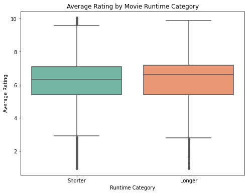
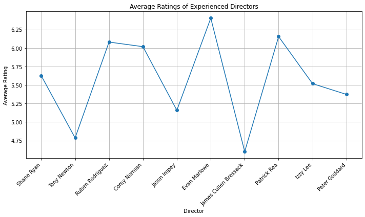
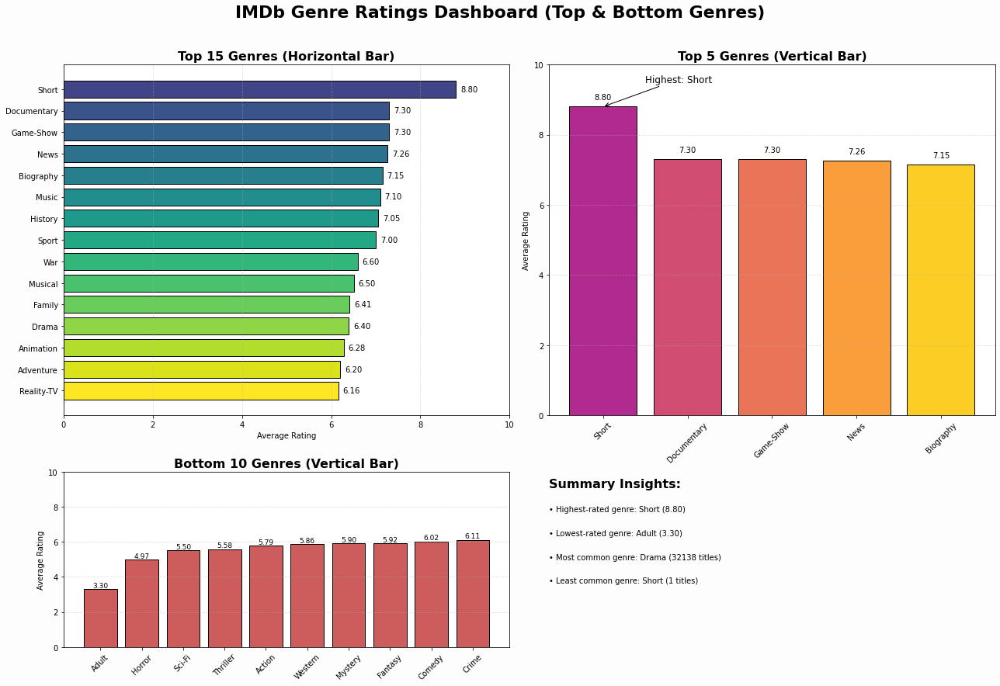

# Movie Studio Launch Blueprint

**Authors:** [David Mburu](www.linkedin.com/in/david-g-mburu-b1268a1b7)
             [Julia Maina](https://www.linkedin.com/in/julie-maina-59b866295?utm_source=share&utm_campaign=share_via&utm_content=profile&utm_medium=ios_app)
             [Olin Wachira](https://www.linkedin.com/in/olin-muriu-wachira-235323340?utm_source=share&utm_campaign=share_via&utm_content=profile&utm_medium=android_app)
             [Lyster Kwamboka](https://www.linkedin.com/in/moogi-lyster-755303245?utm_source=share&utm_campaign=share_via&utm_content=profile&utm_medium=android_app)
             [Denzel Tero](mailto:denzelamazon3@gmail.com)

## Overview

In the current film landscape, some factors seem to influence the success of a movie in the box office in terms of ratings and profits made. Genres such as Short films, Drama, Documentary, Game Show and News dominate box office revenues. Other factors that seem to influence movie success are Directors,Actors, Writers Production Budget and movie runtime jus to name a few. The goal of this project is to analyze datasets to find out the strongest factors among these and give solid recommendations to a new movie studio being set up by our company.

## Business Understanding

### Business Problem

Our company sees all the big companies creating original video content and they want to get in on the fun. They have decided to create a new movie studio, but they don’t know anything about creating movies. We are charged with exploring what types of films are currently doing the best at the box office. We must then translate those findings into actionable insights that the head of our company's new movie studio can use to help decide what type of films to create.

### Problem Statement

Our company is creating a new movie studio with the intent of producing new original content. However, we lack the experience and insight into the films that perform well at the box office.  We need to analyze market trends, identify genres, themes, and formats that resonate most with audiences, and translate these findings into clear, data-driven recommendations. 

### Objecives

1. Evaluate the Relationship Between production Budget and Profitability 

This involves analyzing how profit changes as budget increases and if there is  a threshold point after which a further budget increase does not translate to more profits

2. Determine if there is a difference in audience  ratings between the shorter and longer films

Grouping movie types into two categories short and long then analyzing their respective ratings, we can determine if movie length impacts its success

3. Identify the Best Directors to Work With

By checking the experience level and ratings each director gets, we can determine the most suitable directors for the studio

4. To identify the genres that are linked to high average rating

Checking ratings directly answers this question. But also checking the number of films helps identify a niche genre that we can explore

## Data Understanding and Analysis

### The Data
We used data from the [imdb](https://www.imdb.com/) and [The Numbers](https://www.the-numbers.com/) websites for our analysis.

The imdb database contains detailed movie metadata including ratings, genres, runtime, and director information.

The Numbers dataset provides financial information about films, such as production budget and worldwide gross.

### Data Preparation
To ensure we had the data ready for analysis and visualizations, we used these methods to format it:
- **Uniformity:** Verified that all time and financial values were consistently formatted (e.g., runtime in minutes, monetary values in USD format).

- **Missing Values:** Identified missing values in key columns such as runtime_minutes, averagerating, birth_year, and death_year, and considered appropriate handling methods (e.g., imputation or exclusion).

- **Outliers:** Investigated extreme values in production_budget, worldwide_gross, and averagerating to assess their validity and potential influence on the analysis.

- **Data Merging Accuracy:** Ensured correct alignment when joining IMDb tables using movie_id and person_id to avoid mismatches.

### Analysis and Results

The more the production budget of a movie, the higher the profit it makes up to a certain point where a budget increase does not translate to more profit. Other factors now step in to increase profit as shown below

The longer the movie, the higher the ratings

Experienced director ratings. One can pick any among these and they would be suitable for making a movie

Highest rated genres

## Conclusion

From the findings from the visualizations above, we can conclude that:

- Increasing production budget of a movie increases its profits
- Long films tend to have higher ratings than shorter ones
- The most experienced directors tend to have lower average ratings than inexperienced ones due to the number of movies involved. Hence it is not enough to look at ratings only
- Certain genres tend to receive better ratings than others

From these conclusions, we would recommend to the head of the new movie studio to:

1. Invest heavily budget-wise in the production of films
2. Make long movies (more than 120 minutes long)
3. Work with these best directors in the industry: Sergey A., Evan marlowe, Patrick Rea

### More Information
For further clarity or other inquiries, do not hesitate to reach out to us:

**David Mburu:** [LinkedIn](www.linkedin.com/in/david-g-mburu-b1268a1b7)
                 [Email](mailto:daveygmbur@gmail.com)

**Julia Maina:** [LinkedIn](https://www.linkedin.com/in/julie-maina-59b866295?utm_source=share&utm_campaign=share_via&utm_content=profile&utm_medium=ios_app)
                 [Email](mailto:juliemaina97@gmail.com)

**Olin Wachira:** [LinkedIn](https://www.linkedin.com/in/olin-muriu-wachira-235323340?utm_source=share&utm_campaign=share_via&utm_content=profile&utm_medium=android_app) 
                 [Email](mailto:Muriuolinn@gmail.com)

**Lyster Moogi:** [LinkedIn](https://www.linkedin.com/in/moogi-lyster-755303245?utm_source=share&utm_campaign=share_via&utm_content=profile&utm_medium=android_app)
                  [Email](mailto:kwambokalyster20@gmail.com)

**Denzel Tero:** [Email](mailto:denzelamazon3@gmail.com)